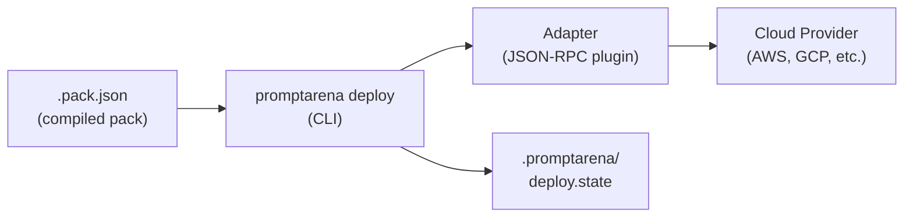

**Deploy prompt packs to any cloud provider using adapter plugins**

---

## What is Deploy?

Deploy is PromptKit's extensible deployment framework. It ships prompt packs to cloud providers through **adapters**—plugin binaries that translate a universal deploy workflow into provider-specific API calls.

### Why Adapters?

Cloud providers each have unique APIs, resource models, and authentication flows. Rather than building every integration into the CLI, Deploy uses a plugin architecture:

- **Provider-agnostic CLI** — Same commands for every target
- **Adapter plugins** — Small binaries that speak JSON-RPC over stdio
- **State tracking** — Checksums, timestamps, and adapter state persisted locally
- **Environment support** — Dev, staging, and production from a single config

### What Deploy Does

- **Plans** deployments before applying them (like `terraform plan`)
- **Applies** changes with streaming progress feedback
- **Tracks** deployment state with checksums and versioning
- **Destroys** resources cleanly when no longer needed
- **Manages** adapter installation and discovery

---

## Quick Start

```bash
# Install an adapter
promptarena deploy adapter install agentcore

# Add deploy config to arena.yaml
cat >> arena.yaml <<'EOF'
deploy:
  provider: agentcore
  config:
    region: us-west-2
EOF

# Preview what will change
promptarena deploy plan

# Deploy
promptarena deploy

# Check status
promptarena deploy status
```

**Next**: [First Deployment Tutorial](/arena/tutorials/deploy/first-deployment/)

---

## How It Works



---

## Documentation by Type

### Tutorials (Learn by Doing)

Step-by-step guides for learning Deploy:

1. [**First Deployment**](/arena/tutorials/deploy/first-deployment/) - Install an adapter, configure, and deploy (20 minutes)
2. [**Multi-Environment**](/arena/tutorials/deploy/multi-environment/) - Dev, staging, and production environments (25 minutes)

### How-To Guides (Accomplish Specific Tasks)

Focused guides for specific tasks:

- [Install Adapters](/arena/how-to/deploy/install-adapters/) - Install, list, and remove adapters
- [Configure Deploy](/arena/how-to/deploy/configure/) - Set up the deploy section in arena.yaml
- [Log In](/arena/how-to/deploy/login/) - Authenticate in the browser and write the config automatically
- [Plan and Apply](/arena/how-to/deploy/plan-and-apply/) - Plan, apply, status, and destroy workflows
- [CI/CD Integration](/arena/how-to/deploy/ci-cd/) - Automate deployments with GitHub Actions

### Explanation (Understand the Concepts)

Deep dives into Deploy internals:

- [Anatomy of a Deployment](/arena/explanation/deploy/anatomy/) - How a pack and a deploy config combine; what's portable vs environment-bound
- [Adapter Architecture](/arena/explanation/deploy/adapter-architecture/) - Plugin pattern, JSON-RPC, stdio communication
- [State Management](/arena/explanation/deploy/state-management/) - State file, checksums, and deployment lifecycle

### Reference (Look Up Details)

Complete specifications:

- [CLI Commands](/arena/reference/deploy/cli-commands/) - All deploy commands, flags, and examples
- [Adapter SDK](/arena/reference/deploy/adapter-sdk/) - Serve(), ParsePack, ProgressReporter API
- [Protocol](/arena/reference/deploy/protocol/) - JSON-RPC methods, types, and error codes

---

## Supported Adapters

| Adapter | Provider | Description |
|---------|----------|-------------|
| `agentcore` | AWS Bedrock AgentCore | Deploy to AWS Bedrock AgentCore |

More adapters are coming. You can also [build your own](/arena/reference/deploy/adapter-sdk/).

---

## Related Tools

- **PackC**: [Compile prompts into packs](/packc/) — Deploy requires a compiled `.pack.json`
- **Arena**: [Test prompts before deploying](/arena/) — Validate behavior locally first
- **SDK**: [Use deployed packs in Go applications](https://promptkit.altairalabs.ai/sdk/) — Client-side integration
