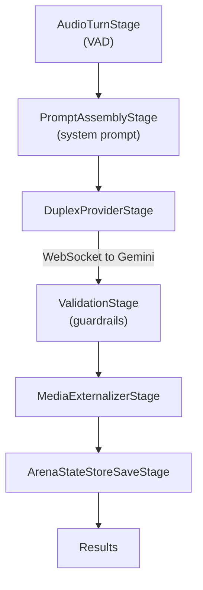
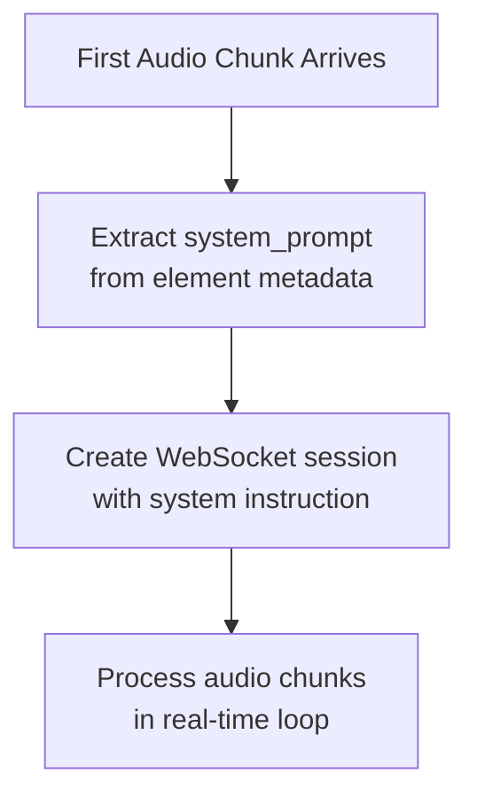
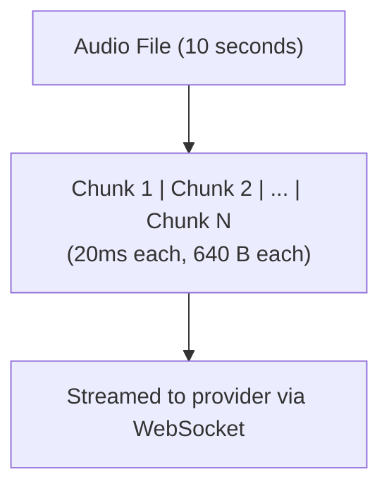
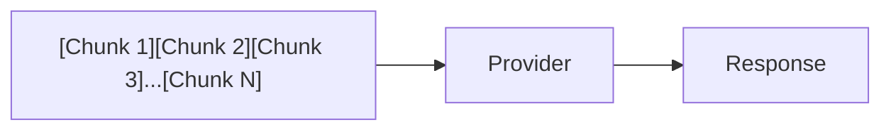
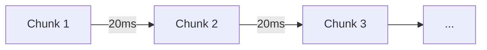
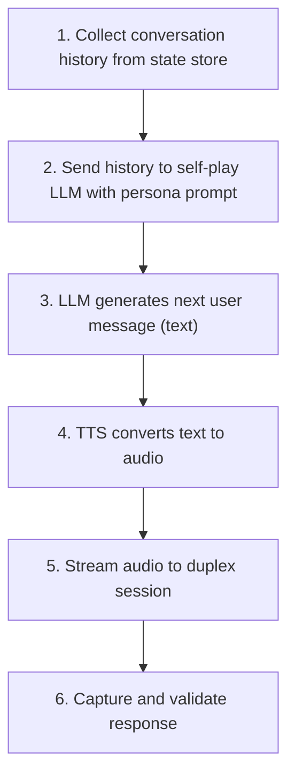

Understanding how PromptArena handles bidirectional audio streaming for voice assistant testing.

## What is Duplex Streaming?

**[Duplex](https://promptkit.altairalabs.ai/glossary#duplex) streaming** enables real-time bidirectional communication between your test scenario and an LLM provider. Unlike traditional request-response patterns, duplex streaming:

- Sends audio in small chunks as it's being "spoken"
- Receives responses while still sending input
- Handles dynamic turn detection (knowing when someone stops speaking)
- Maintains a persistent WebSocket connection

This mirrors how real voice assistants work, making it essential for testing voice interfaces.

## Traditional vs Duplex Audio Testing

### Traditional Audio Testing

```
┌──────────────────────────────────────────────────┐
│ 1. Load entire audio file                        │
│ 2. Send as single blob to provider               │
│ 3. Wait for complete transcription               │
│ 4. Get text response                             │
│ 5. Move to next turn                             │
└──────────────────────────────────────────────────┘
```

**Limitations:**
- No real-time interaction
- Can't test interruption handling
- Doesn't reflect actual voice UX
- Turn boundaries are artificial

### Duplex Audio Testing

```
┌──────────────────────────────────────────────────┐
│ 1. Open WebSocket session                        │
│ 2. Stream audio chunks (640 bytes = 20ms)        │
│ 3. Provider detects speech/silence boundaries    │
│ 4. Receive audio/text response in real-time      │
│ 5. Continue streaming more input                 │
└──────────────────────────────────────────────────┘
```

**Benefits:**
- Tests real-time voice interaction
- Validates turn detection behavior
- Can test interruption scenarios
- Mirrors production voice assistant UX

## Pipeline Architecture

Duplex testing uses the same pipeline architecture as non-duplex, with specialized stages:



### Key Pipeline Stages

| Stage | Purpose |
|-------|---------|
| **AudioTurnStage** | Optional client-side VAD for turn detection |
| **PromptAssemblyStage** | Loads prompt config, adds system instruction to metadata |
| **DuplexProviderStage** | Creates WebSocket session, handles bidirectional I/O |
| **MediaExternalizerStage** | Saves audio responses to files |
| **ValidationStage** | Runs assertions and guardrails on responses |
| **ArenaStateStoreSaveStage** | Persists messages for reporting |

## Session Lifecycle

### Session Creation

Unlike traditional pipelines where each turn creates a new request, duplex maintains a persistent session:



The session is created **lazily** when the first element arrives, using configuration from the pipeline metadata.

### Turn Detection

Two modes are available for detecting when a speaker has finished: [ASM](https://promptkit.altairalabs.ai/glossary#asm) (provider-native) and [VAD](https://promptkit.altairalabs.ai/glossary#vad) (client-side).

#### ASM Mode (Provider-Native)

The provider (e.g., Gemini Live API) handles turn detection internally:

```yaml
duplex:
  turn_detection:
    mode: asm
```

- Provider signals when user stops speaking
- Simpler configuration
- Provider-specific behavior

#### VAD Mode (Voice Activity Detection)

Client-side VAD with configurable thresholds:

```yaml
duplex:
  turn_detection:
    mode: vad
    vad:
      silence_threshold_ms: 600
      min_speech_ms: 200
```

- Precise control over turn boundaries
- Consistent across providers
- Requires threshold tuning

## Audio Processing

### Input Audio Format

Audio must be in raw PCM format:

| Parameter | Value | Reason |
|-----------|-------|--------|
| Format | Raw PCM (no headers) | Direct streaming |
| Sample Rate | 16000 Hz | Gemini requirement |
| Bit Depth | 16-bit | Standard voice quality |
| Channels | Mono | Voice doesn't need stereo |

### Chunk Streaming

Audio is sent in small chunks to enable real-time processing:



**Chunk size calculation:**
- 16000 samples/second × 2 bytes/sample × 0.02 seconds = 640 bytes per 20ms chunk

### Burst Mode vs Real-time Mode

#### Burst Mode (Default for Testing)

Sends all audio as fast as possible:



**Best for:** Pre-recorded audio, avoiding false turn detections from natural pauses.

#### Real-time Mode

Paces audio to match actual speech timing:



**Best for:** Testing real-time interaction, interruption handling.

## Self-Play with TTS

For fully automated testing, self-play mode uses [TTS](https://promptkit.altairalabs.ai/glossary#tts) to generate audio dynamically:



This enables testing multi-turn voice conversations without pre-recording audio files.

## Error Handling and Resilience

Voice sessions are inherently less stable than text sessions due to:

- Network latency variations
- Provider-side connection limits
- Audio processing delays
- Turn detection edge cases

### Resilience Configuration

```yaml
duplex:
  resilience:
    max_retries: 2              # Retry failed sessions
    retry_delay_ms: 2000        # Wait between retries
    inter_turn_delay_ms: 500    # Pause between turns
    partial_success_min_turns: 2 # Accept if N turns succeed
    ignore_last_turn_session_end: true
```

### Partial Success

Not all tests need to complete every turn. For exploratory testing:

```yaml
resilience:
  partial_success_min_turns: 3  # Success if 3+ turns complete
```

This allows testing to continue even when sessions end early.

## Comparison with SDK Duplex

Both Arena and the SDK use the same underlying runtime for duplex streaming:

| Aspect | Arena | SDK |
|--------|-------|-----|
| Pipeline builder | Internal | Configurable |
| Session lifecycle | Managed by executor | Managed by application |
| State storage | Arena state store | Application-provided |
| Use case | Automated testing | Production applications |

The `runtime/streaming` package provides shared utilities for both.

## Design Decisions

### Why Pipeline-First Architecture?

The pipeline runs **before** session creation because:

1. **Consistency**: Same pattern as non-duplex pipelines
2. **Flexibility**: Prompt assembly can vary per scenario
3. **Validation**: Guardrails apply to all response types
4. **Debugging**: Each stage can be inspected independently

### Why Lazy Session Creation?

Sessions are created when the first audio arrives because:

1. **Configuration**: System prompt comes from pipeline metadata
2. **Resource efficiency**: Don't create sessions that won't be used
3. **Error handling**: Pipeline errors caught before session cost

### Why Burst Mode for Pre-recorded Audio?

Provider turn detection can trigger mid-utterance with natural speech pauses. Burst mode sends all audio before any turn detection occurs, preventing "user interrupted" false positives.

## See Also

- [Tutorial: Duplex Voice Testing](/arena/tutorials/06-duplex-testing/) - Hands-on guide
- [Duplex Configuration Reference](/arena/reference/duplex-config/) - Full config options
- [Testing Philosophy](/arena/explanation/testing-philosophy/) - Core testing principles
