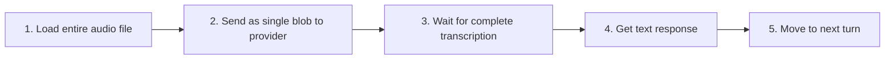
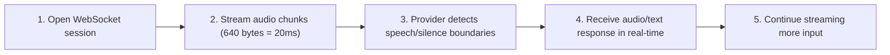
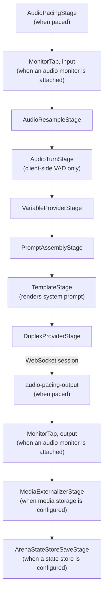
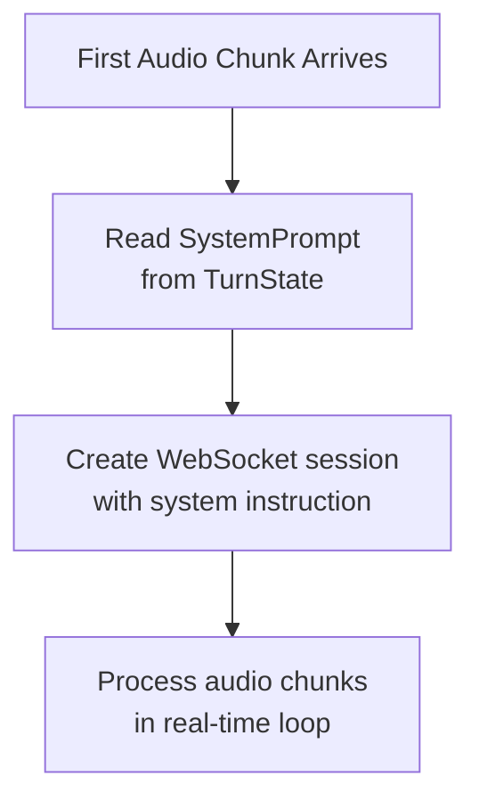
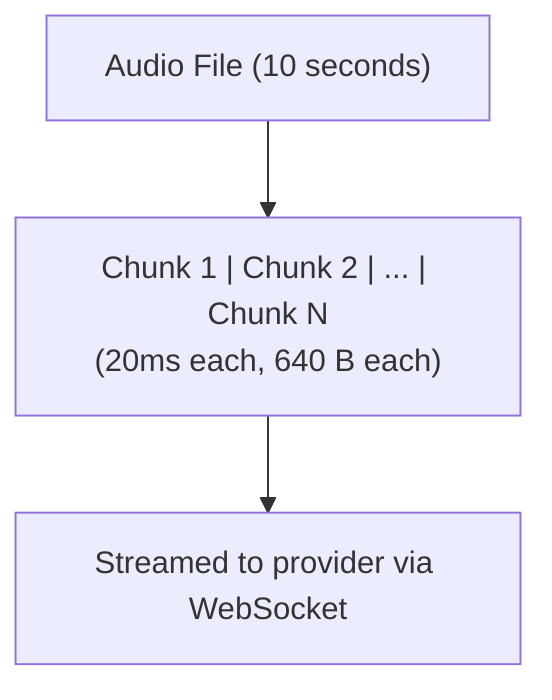
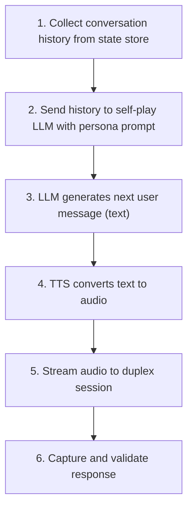

Understanding how PromptArena handles bidirectional audio streaming for voice assistant testing.

## What is Duplex Streaming?

[Duplex](https://promptkit.altairalabs.ai/glossary#duplex) streaming enables real-time bidirectional communication between your test scenario and an LLM provider. A traditional request-response test sends a whole turn and waits. Duplex streaming:

- Sends audio in small chunks as it's being "spoken"
- Receives responses while still sending input
- Handles dynamic turn detection (knowing when someone stops speaking)
- Maintains a persistent WebSocket connection

This mirrors how real voice assistants work, making it essential for testing voice interfaces.

## Traditional vs Duplex Audio Testing

### Traditional Audio Testing

Each turn runs these steps in sequence:


```mermaid
flowchart LR
    A["1. Load entire audio file"] --> B["2. Send as single blob to provider"]
    B --> C["3. Wait for complete transcription"]
    C --> D["4. Get text response"]
    D --> E["5. Move to next turn"]
```

Limitations:

- No real-time interaction
- Can't test interruption handling
- Doesn't reflect actual voice UX
- Turn boundaries are artificial

### Duplex Audio Testing

A duplex session runs these steps:


```mermaid
flowchart LR
    A["1. Open WebSocket session"] --> B["2. Stream audio chunks (640 bytes = 20ms)"]
    B --> C["3. Provider detects speech/silence boundaries"]
    C --> D["4. Receive audio/text response in real-time"]
    D --> E["5. Continue streaming more input"]
```

Benefits:

- Tests real-time voice interaction
- Validates turn detection behavior
- Can test interruption scenarios
- Mirrors production voice assistant UX

## Pipeline Architecture

Duplex testing uses the same pipeline architecture as non-duplex, with specialized stages. This diagram shows the stage order, with each conditional stage labelled with the condition that adds it.


```mermaid
flowchart TD
    pin["AudioPacingStage<br/>(when paced)"] --> tin["MonitorTap, input<br/>(when an audio monitor is attached)"]
    tin --> rs["AudioResampleStage"]
    rs --> ats["AudioTurnStage<br/>(client-side VAD only)"]
    ats --> vps["VariableProviderStage"]
    vps --> pas["PromptAssemblyStage"]
    pas --> ts["TemplateStage<br/>(renders system prompt)"]
    ts --> dps["DuplexProviderStage"]
    dps -->|WebSocket session| pout["audio-pacing-output<br/>(when paced)"]
    pout --> tout["MonitorTap, output<br/>(when an audio monitor is attached)"]
    tout --> mes["MediaExternalizerStage<br/>(when media storage is configured)"]
    mes --> ass["ArenaStateStoreSaveStage<br/>(when a state store is configured)"]
```

[Audio Pacing](#audio-pacing) explains when a run is paced.

### Key Pipeline Stages

See [Duplex Configuration Reference](/arena/reference/duplex-config/) for every stage and option.

## Session Lifecycle

### Session Creation

Unlike traditional pipelines where each turn creates a new request, duplex maintains a persistent session:


```mermaid
flowchart TD
    start["First Audio Chunk Arrives"] --> extract["Read SystemPrompt<br/>from TurnState"]
    extract --> create["Create WebSocket session<br/>with system instruction"]
    create --> process["Process audio chunks<br/>in real-time loop"]
```

The session is created lazily when the first element arrives. `PromptAssemblyStage` loads the prompt template into the shared `TurnState`, `TemplateStage` renders the system prompt into it, and `DuplexProviderStage` reads it at session creation.

### Turn Detection

Two modes are available for detecting when a speaker has finished: [ASM](https://promptkit.altairalabs.ai/glossary#asm) (provider-native) and [VAD](https://promptkit.altairalabs.ai/glossary#vad) (client-side). If a scenario omits `turn_detection`, Arena uses client-side VAD, which is why `AudioTurnStage` usually appears in the pipeline. ASM applies only when `turn_detection` is present and its mode is not `vad`.

#### ASM Mode (Provider-Native)

The provider (for example, the Gemini Live API) handles turn detection internally. Arena adds no `AudioTurnStage`, so the provider's server-side detection decides where a turn ends.

- Provider signals when user stops speaking
- Simpler configuration
- Provider-specific behavior

Choose ASM when you want the provider's own turn behavior, as a production client would get. See [Duplex Configuration Reference](/arena/reference/duplex-config/) for the `turn_detection` settings.

#### VAD Mode (Voice Activity Detection)

Client-side VAD with configurable thresholds. See [Duplex Configuration Reference](/arena/reference/duplex-config/) for the `vad` settings.

- Precise control over turn boundaries
- Consistent across providers
- Requires threshold tuning

Choose VAD when you need the same turn boundaries across providers, or when you want to tune how long a silence ends a turn.

## Audio Processing

### Input Audio Format

Input audio should be 16 kHz mono, supplied as a WAV file or as raw PCM. Arena reads WAV files and converts 24-bit, 32-bit and float samples to 16-bit PCM, but it treats raw PCM files as 16 kHz mono 16-bit.

The rate and channel count matter because Arena does not read them from the file. It labels every chunk as 16 kHz mono, and `AudioResampleStage` then converts that audio to the rate the provider expects. A file recorded at another rate or in stereo is mislabelled rather than converted, so it plays back at the wrong speed or garbled. See [Duplex Configuration Reference](/arena/reference/duplex-config/) for the format parameters.

### Chunk Streaming

Audio is sent in small chunks to enable real-time processing:


```mermaid
flowchart TD
    file["Audio File (10 seconds)"] --> chunks["Chunk 1 | Chunk 2 | ... | Chunk N<br/>(20ms each, 640 B each)"]
    chunks --> stream["Streamed to provider via WebSocket"]
```

**Chunk size calculation:**
- 16000 samples/second × 2 bytes/sample × 0.02 seconds = 640 bytes per 20ms chunk

### Audio Pacing

Arena reads an audio file, or receives TTS audio, far faster than it would play. `AudioPacingStage` holds each chunk back until the time it would reach a listener, worked out from the chunk's length and sample rate, so the audio leaves the stage at playback rate. The first five chunks of each utterance go through at once, as a small buffer against scheduling jitter. Pacing is not a setting. Arena decides per run whether anything downstream depends on when audio arrives.

The provider's VAD does. A provider times the silence at the end of a turn by when audio arrives, not by what the audio contains. If a 10-second recording arrives in a few milliseconds, the provider sees almost no speech, and it can end the turn at once. Pacing scripted, pre-recorded audio to real time lets the provider time silence the way it would with a live caller. Arena therefore paces every run unless the arena config enables `self_play`.

A live audio monitor also depends on arrival time. When one is attached, through `--audio-monitor on` or `auto` with a terminal on stdout, Arena paces the run so playback drains smoothly, whether or not self-play is enabled. A second pacing stage, `audio-pacing-output`, does the same for the provider's audio. Realtime providers stream their reply faster than it plays, and without output pacing the reply would still be playing when the next turn starts.

Audio goes unpaced only when self-play is enabled and no audio monitor is attached, which is the usual headless CI self-play run. With self-play enabled, Arena turns off the provider's VAD for any scenario with persona-driven turns, so in those scenarios nothing reads arrival time and pacing would only add wall-clock time. The decision covers the whole run, so a scripted scenario in an arena config that enables self-play is also unpaced when no monitor is attached.

## Self-Play with TTS

For fully automated testing, self-play mode uses [TTS](https://promptkit.altairalabs.ai/glossary#tts) to generate audio dynamically:


```mermaid
flowchart TD
    s1["1. Collect conversation history from state store"] --> s2["2. Send history to self-play LLM with persona prompt"]
    s2 --> s3["3. LLM generates next user message (text)"]
    s3 --> s4["4. TTS converts text to audio"]
    s4 --> s5["5. Stream audio to duplex session"]
    s5 --> s6["6. Capture and validate response"]
```

This enables testing multi-turn voice conversations without pre-recording audio files.

## Error Handling and Resilience

Voice sessions are inherently less stable than text sessions due to:

- Network latency variations
- Provider-side connection limits
- Audio processing delays
- Turn detection edge cases

### Resilience Configuration

See [Duplex Configuration Reference](/arena/reference/duplex-config/) for the `resilience` settings and their defaults.

### Partial Success

Not all tests need to complete every turn. Voice sessions can end early for reasons outside the scenario, so a strict pass/fail hides how far a session got. Counting a session as a success after a minimum number of turns suits exploratory testing, where you want to see how the provider behaves up to that point:

```yaml
resilience:
  partial_success_min_turns: 3  # Success if 3+ turns complete
```

This allows testing to continue even when sessions end early.

## Comparison with SDK Duplex

Both Arena and the SDK use the same underlying runtime for duplex streaming:

| Aspect | Arena | SDK |
|--------|-------|-----|
| Pipeline builder | Internal | Configurable |
| Session lifecycle | Managed by executor | Managed by application |
| State storage | Arena state store | Application-provided |
| Use case | Automated testing | Production applications |

The `runtime/streaming` package provides shared utilities for both.

## Design Decisions

### Why Pipeline-First Architecture?

The pipeline runs before session creation, for these reasons:

- Consistency: the pattern matches non-duplex pipelines.
- Flexibility: prompt assembly can vary per scenario.
- Debugging: you can inspect each stage independently.

### Why Lazy Session Creation?

Sessions are created when the first audio arrives, for these reasons:

- Configuration: the system prompt comes from the pipeline's `TurnState`.
- Resource efficiency: no session is created that goes unused.
- Error handling: pipeline errors surface before the session costs anything.

### Why Pace Pre-recorded Audio?

A provider's VAD times turn-end silence by arrival, so audio that arrives faster than it plays tells the provider the user spoke for less time than they did. Pacing at playback rate keeps a test's turn boundaries the same as a live caller's. It costs the audio's own duration in wall-clock time, which is why Arena skips it only where nothing reads that timing. See [Audio Pacing](#audio-pacing).

## See Also

- [Tutorial: Duplex Voice Testing](/arena/tutorials/06-duplex-testing/) - Hands-on guide
- [Duplex Configuration Reference](/arena/reference/duplex-config/) - Full config options
- [Testing Philosophy](/arena/explanation/testing-philosophy/) - Core testing principles
