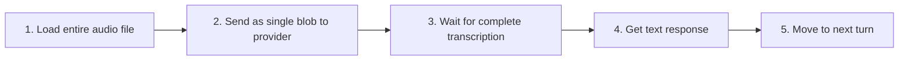
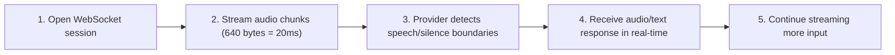
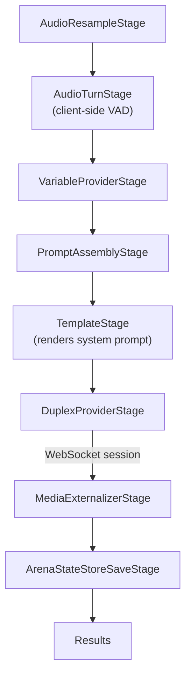
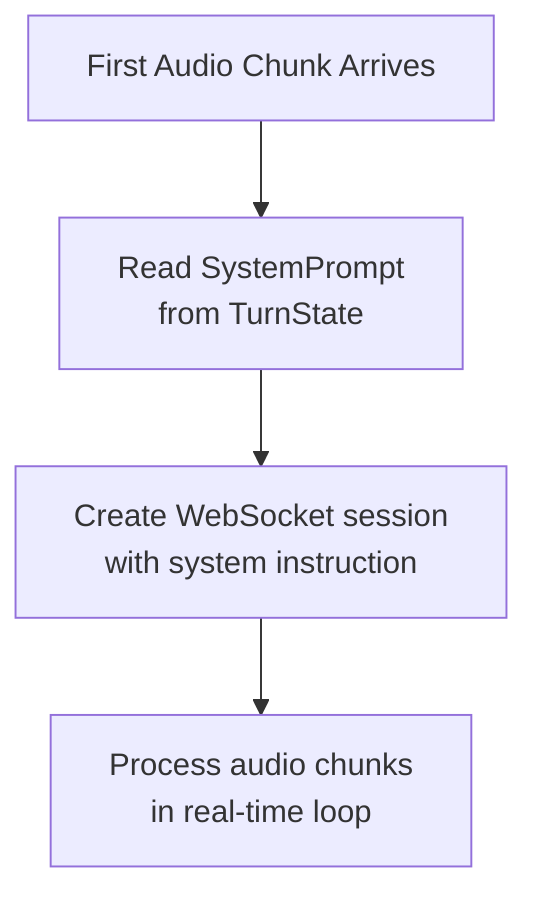
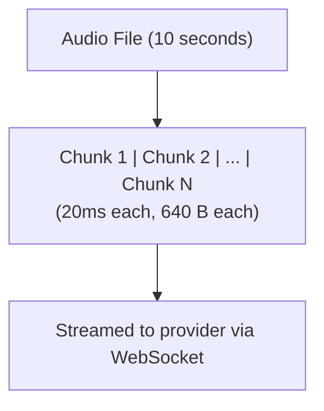
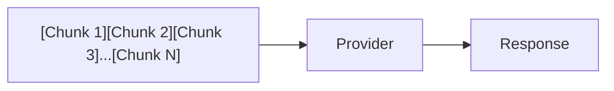
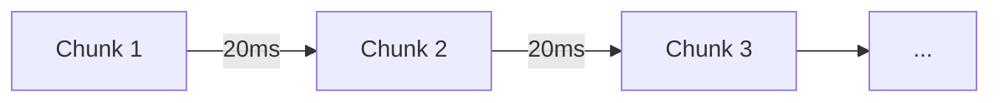
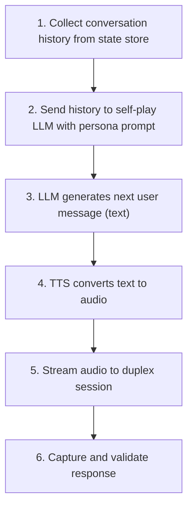

Understanding how PromptArena handles bidirectional audio streaming for voice assistant testing.

## What is Duplex Streaming?

[Duplex](https://promptkit.altairalabs.ai/glossary#duplex) streaming enables real-time bidirectional communication between your test scenario and an LLM provider. A traditional request-response test sends a whole turn and waits. Duplex streaming:

- Sends audio in small chunks as it's being "spoken"
- Receives responses while still sending input
- Handles dynamic turn detection (knowing when someone stops speaking)
- Maintains a persistent WebSocket connection

This mirrors how real voice assistants work, making it essential for testing voice interfaces.

## Traditional vs Duplex Audio Testing

### Traditional Audio Testing

Each turn runs these steps in sequence:


```mermaid
flowchart LR
    A["1. Load entire audio file"] --> B["2. Send as single blob to provider"]
    B --> C["3. Wait for complete transcription"]
    C --> D["4. Get text response"]
    D --> E["5. Move to next turn"]
```

Limitations:

- No real-time interaction
- Can't test interruption handling
- Doesn't reflect actual voice UX
- Turn boundaries are artificial

### Duplex Audio Testing

A duplex session runs these steps:


```mermaid
flowchart LR
    A["1. Open WebSocket session"] --> B["2. Stream audio chunks (640 bytes = 20ms)"]
    B --> C["3. Provider detects speech/silence boundaries"]
    C --> D["4. Receive audio/text response in real-time"]
    D --> E["5. Continue streaming more input"]
```

Benefits:

- Tests real-time voice interaction
- Validates turn detection behavior
- Can test interruption scenarios
- Mirrors production voice assistant UX

## Pipeline Architecture

Duplex testing uses the same pipeline architecture as non-duplex, with specialized stages. This diagram shows the stage order; `AudioTurnStage` runs only with client-side VAD, and the last two stages run only when media storage and a state store are configured.


```mermaid
flowchart TD
    rs["AudioResampleStage"] --> ats["AudioTurnStage<br/>(client-side VAD)"]
    ats --> vps["VariableProviderStage"]
    vps --> pas["PromptAssemblyStage"]
    pas --> ts["TemplateStage<br/>(renders system prompt)"]
    ts --> dps["DuplexProviderStage"]
    dps -->|WebSocket session| mes["MediaExternalizerStage"]
    mes --> ass["ArenaStateStoreSaveStage"]
    ass --> res["Results"]
```

### Key Pipeline Stages

See [Duplex Configuration Reference](/arena/reference/duplex-config/) for every stage and option.

## Session Lifecycle

### Session Creation

Unlike traditional pipelines where each turn creates a new request, duplex maintains a persistent session:


```mermaid
flowchart TD
    start["First Audio Chunk Arrives"] --> extract["Read SystemPrompt<br/>from TurnState"]
    extract --> create["Create WebSocket session<br/>with system instruction"]
    create --> process["Process audio chunks<br/>in real-time loop"]
```

The session is created lazily when the first element arrives. `PromptAssemblyStage` loads the prompt template into the shared `TurnState`, `TemplateStage` renders the system prompt into it, and `DuplexProviderStage` reads it at session creation.

### Turn Detection

Two modes are available for detecting when a speaker has finished: [ASM](https://promptkit.altairalabs.ai/glossary#asm) (provider-native) and [VAD](https://promptkit.altairalabs.ai/glossary#vad) (client-side).

#### ASM Mode (Provider-Native)

The provider (e.g., Gemini Live API) handles turn detection internally:

See [Duplex Configuration Reference](/arena/reference/duplex-config/) for the `turn_detection` settings.

- Provider signals when user stops speaking
- Simpler configuration
- Provider-specific behavior

#### VAD Mode (Voice Activity Detection)

Client-side VAD with configurable thresholds. See [Duplex Configuration Reference](/arena/reference/duplex-config/) for the `vad` settings.

- Precise control over turn boundaries
- Consistent across providers
- Requires threshold tuning

## Audio Processing

### Input Audio Format

Audio must be raw 16 kHz, 16-bit, mono PCM. See [Duplex Configuration Reference](/arena/reference/duplex-config/) for the format parameters.

### Chunk Streaming

Audio is sent in small chunks to enable real-time processing:


```mermaid
flowchart TD
    file["Audio File (10 seconds)"] --> chunks["Chunk 1 | Chunk 2 | ... | Chunk N<br/>(20ms each, 640 B each)"]
    chunks --> stream["Streamed to provider via WebSocket"]
```

**Chunk size calculation:**
- 16000 samples/second × 2 bytes/sample × 0.02 seconds = 640 bytes per 20ms chunk

### Burst Mode vs Real-time Mode

#### Burst Mode (Default for Testing)

Sends all audio as fast as possible:


```mermaid
flowchart LR
    chunks["[Chunk 1][Chunk 2][Chunk 3]...[Chunk N]"] --> provider["Provider"]
    provider --> response["Response"]
```

Best for pre-recorded audio, avoiding false turn detections from natural pauses.

#### Real-time Mode

Paces audio to match actual speech timing:


```mermaid
flowchart LR
    c1["Chunk 1"] -->|20ms| c2["Chunk 2"]
    c2 -->|20ms| c3["Chunk 3"]
    c3 --> more["..."]
```

Best for testing real-time interaction, interruption handling.

## Self-Play with TTS

For fully automated testing, self-play mode uses [TTS](https://promptkit.altairalabs.ai/glossary#tts) to generate audio dynamically:


```mermaid
flowchart TD
    s1["1. Collect conversation history from state store"] --> s2["2. Send history to self-play LLM with persona prompt"]
    s2 --> s3["3. LLM generates next user message (text)"]
    s3 --> s4["4. TTS converts text to audio"]
    s4 --> s5["5. Stream audio to duplex session"]
    s5 --> s6["6. Capture and validate response"]
```

This enables testing multi-turn voice conversations without pre-recording audio files.

## Error Handling and Resilience

Voice sessions are inherently less stable than text sessions due to:

- Network latency variations
- Provider-side connection limits
- Audio processing delays
- Turn detection edge cases

### Resilience Configuration

See [Duplex Configuration Reference](/arena/reference/duplex-config/) for the `resilience` settings and their defaults.

### Partial Success

Not all tests need to complete every turn. For exploratory testing:

```yaml
resilience:
  partial_success_min_turns: 3  # Success if 3+ turns complete
```

This allows testing to continue even when sessions end early.

## Comparison with SDK Duplex

Both Arena and the SDK use the same underlying runtime for duplex streaming:

| Aspect | Arena | SDK |
|--------|-------|-----|
| Pipeline builder | Internal | Configurable |
| Session lifecycle | Managed by executor | Managed by application |
| State storage | Arena state store | Application-provided |
| Use case | Automated testing | Production applications |

The `runtime/streaming` package provides shared utilities for both.

## Design Decisions

### Why Pipeline-First Architecture?

The pipeline runs before session creation, for these reasons:

- Consistency: the pattern matches non-duplex pipelines.
- Flexibility: prompt assembly can vary per scenario.
- Debugging: you can inspect each stage independently.

### Why Lazy Session Creation?

Sessions are created when the first audio arrives, for these reasons:

- Configuration: the system prompt comes from the pipeline's `TurnState`.
- Resource efficiency: no session is created that goes unused.
- Error handling: pipeline errors surface before the session costs anything.

### Why Burst Mode for Pre-recorded Audio?

Provider turn detection can trigger mid-utterance with natural speech pauses. Burst mode sends all audio before any turn detection occurs, preventing "user interrupted" false positives.

## See Also

- [Tutorial: Duplex Voice Testing](/arena/tutorials/06-duplex-testing/) - Hands-on guide
- [Duplex Configuration Reference](/arena/reference/duplex-config/) - Full config options
- [Testing Philosophy](/arena/explanation/testing-philosophy/) - Core testing principles
