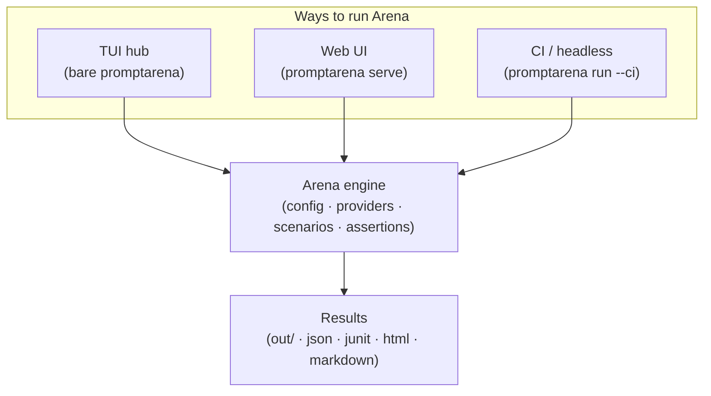

Arena is one engine with three front doors. The same config, the same providers, the same
scenarios and assertions run underneath all of them — what changes is how you drive a run and
how you watch it unfold. Those three surfaces are:

1. **The TUI** — a full-screen interactive terminal hub for local development and exploration.
2. **The Web UI** — a local web server with a dashboard and live streaming, for visual monitoring and demos.
3. **CI / headless** — plain-log, machine-readable execution for automation and regression gates.

Most people meet Arena through one of these and never realise the other two exist. This page
exists to make them discoverable, explain what each is for, and point you at the how-to guide
for whichever fits the task in front of you.

## At a glance

| Interface | How you launch it | Best for |
|-----------|-------------------|----------|
| **TUI** | `promptarena` (bare), or `promptarena view` / `promptarena chat` to deep-link | Local interactive development, exploring past results, ad-hoc chat |
| **Web UI** | `promptarena serve` (opens `http://127.0.0.1:8080`) | Visual monitoring, sharing a run view, demos |
| **CI / headless** | `promptarena run --ci` (alias `--simple`) | Automation, regression gates, pipelines |

## One engine, three surfaces

None of these is a wrapper around another — they are peers that all sit on top of the same
execution engine. A run started from the TUI, the browser, or a CI pipeline produces the same
result artifacts in the same `out/` directory. Picking an interface is a decision about
ergonomics and audience, not about capability.

## The TUI: interactive terminal hub

Running `promptarena` with no subcommand opens a full-screen [Bubble Tea](https://github.com/charmbracelet/bubbletea)
hub. The hub has four pages:

- **View** — browse and inspect past run results.
- **Run** — launch scenarios and watch turns execute live.
- **Chat** — talk to an agent defined in your config, in text or hands-free voice.
- **Inspect** — examine the resolved configuration Arena is working from.

Two subcommands deep-link straight into the hub for a single task: `promptarena view` opens the
results browser, and `promptarena chat` opens an interactive chat session (add `--voice` for
hands-free voice mode). Everything is keyboard-driven and lives entirely in your terminal.

The TUI is the natural home for local iteration: you are editing prompts and scenarios, running
them, reading what came back, and trying again. It is the default because that loop is the most
common way people work with Arena day to day.

See [Use the TUI](/arena/how-to/interfaces/use-the-tui/).

## The Web UI: local web server with live streaming

`promptarena serve` starts a local web server bound to `127.0.0.1:8080`. It serves a React
single-page app backed by a REST API, and streams run events to the browser over
Server-Sent Events (SSE). From the browser you get a dashboard, live monitoring of a run as its
turns complete, the ability to start a run without touching the terminal, an interactive chat
tab, and real-time audio monitoring for voice agents.

The Web UI shines when you want a run to be *watchable* by more than one person or by someone who
is not living in a terminal — a demo, a screen-share, or a shared view of a long run in progress.
For demos without live provider credentials, pair it with `--mock-provider` so canned responses
drive the conversation while tools still execute for real.

The server is bound to loopback and is not meant to be exposed publicly — it is a local
companion to your workflow, not a hosted service.

See [Use the Web UI](/arena/how-to/interfaces/use-the-web-ui/).

## CI / headless: plain logs and machine-readable reports

`promptarena run --ci` (with `--simple` as an alias) disables the interactive TUI entirely and
emits plain, line-oriented logs suitable for a build log. Instead of an animated terminal, you
get a deterministic stream of text and a set of report files written to disk.

Reports are selected with `--format` (alias `--formats`), which accepts any combination of:

- `json` — structured results for downstream tooling.
- `junit` — JUnit XML for test dashboards and CI result panes.
- `html` — a self-contained human-readable report.
- `markdown` — a report you can drop into a PR comment or wiki.

This is the surface for automation: regression gates that fail a build when assertions break,
scheduled evaluation jobs, and any pipeline that needs a machine-readable verdict rather than a
person watching a screen. A packaged GitHub Action wraps this mode so you can run Arena as a step
in a workflow without installing the binary yourself.

See [Run Arena in CI](/arena/how-to/interfaces/run-in-ci/).

## Choosing between them

The three surfaces are not a progression you graduate through — they coexist, and most projects
use more than one. A useful rule of thumb:

- Reach for the **TUI** when *you* are the audience and you are iterating locally.
- Reach for the **Web UI** when *other people* are the audience, or you want a richer visual view.
- Reach for **CI / headless** when *no one* is watching and a machine needs the result.

Because they share an engine and a config, moving between them costs nothing. The scenarios you
refine in the TUI are the same ones your CI pipeline gates on, and the same ones you can put up on
screen with `serve` when it is time to show your work.

## See also

- [Use the TUI](/arena/how-to/interfaces/use-the-tui/)
- [Use the Web UI](/arena/how-to/interfaces/use-the-web-ui/)
- [Run Arena in CI](/arena/how-to/interfaces/run-in-ci/)
- [Reference: CLI Commands](/arena/reference/cli-commands/)
