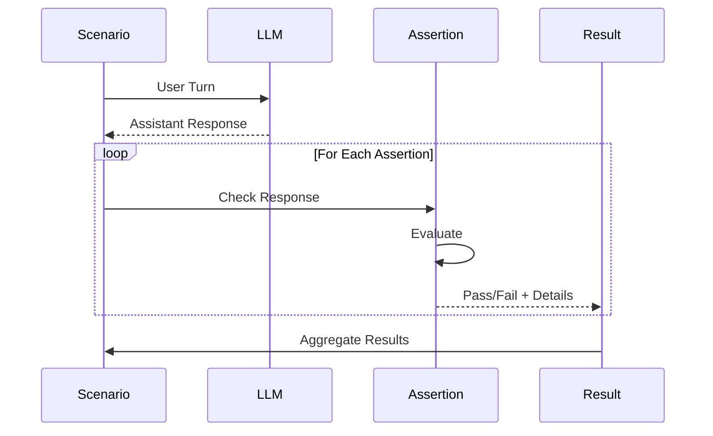

Assertions are checks that verify LLM behavior during Arena test scenarios. They run after each turn (or across the full session) and determine whether the response meets expectations.

:::tip[Looking for check types?]
For the complete list of available check types and their parameters, see the [Checks Reference](https://promptkit.altairalabs.ai/reference/checks/).
:::

## How Assertions Work



## Assertion Structure

All assertions follow this structure:

```yaml
assertions:
  - type: assertion_name          # Required: Assertion type
    params:                       # Required: Type-specific parameters
      param1: value1
      param2: value2
    message: "Description"        # Optional: Human-readable description
    when:                         # Optional: Conditional filtering
      tool_called: "tool_name"
    pass_threshold: 0.8           # Optional: Required pass rate for trial runs (0.0-1.0)
```

**Fields**:
- `type`: The check type to use (see [Checks Reference](https://promptkit.altairalabs.ai/reference/checks/) for all available types)
- `params`: Parameters specific to the check type
- `message`: Optional description shown in reports
- `when`: Optional conditions that must be met for the assertion to run (see [Conditional Filtering](#conditional-filtering-when))
- `pass_threshold`: Optional pass rate threshold when using trials (default: 1.0 = all must pass)

## Common Assertion Types

The table below lists the most commonly used assertion types. For full details and parameters, see the [Checks Reference](https://promptkit.altairalabs.ai/reference/checks/).

| Type | Description |
|------|-------------|
| `content_includes` | Response contains specific text patterns (case-insensitive) |
| `content_excludes` | Response does not contain forbidden text |
| `content_matches` | Response matches a regular expression |
| `tools_called` | Specific tools were invoked during the turn |
| `tools_not_called` | Specific tools were not invoked |
| `llm_judge` | LLM evaluates response quality against criteria |
| `json_schema` | Response conforms to a JSON Schema |
| `no_tool_errors` | All tool calls completed without errors |
| `tool_call_chain` | Tools were called in a specific order |
| `tool_exec` | Invoke a registered tool (e.g. a sandbox's `run_tests`) at session end and assert it succeeded |

:::note[Type aliases]
Assertions support both canonical and alias names. For example, `content_includes` is an alias for `contains`. See the [Checks Reference](https://promptkit.altairalabs.ai/reference/checks/#assertion-aliases) for the full alias table.
:::

## Session vs Turn-Level Assertions

Assertions can be scoped to a single turn or to the entire conversation session.

**Turn-level assertions** are declared on individual turns and check only that turn's response:

```yaml
turns:
  - role: user
    content: "What is the capital of France?"
    assertions:
      - type: content_includes
        params:
          patterns: ["Paris"]
        message: "Should mention Paris"
```

**Session-level assertions** are declared at the scenario level using `conversation_assertions` and evaluate across the full conversation:

```yaml
conversation_assertions:
  - type: assertion
    params:
      eval_type: llm_judge_session
      eval_params:
        criteria: "The assistant maintained a helpful tone throughout"
      min_score: 0.8
    message: "Overall tone check"
```

## Representative Examples

### Content check

```yaml
- role: user
  content: "What is the capital of France?"
  assertions:
    - type: content_includes
      params:
        patterns: ["Paris"]
      message: "Should mention Paris"
```

### Tool usage check

Assert that the LLM invoked the right tool (and, optionally, with a minimum frequency):

```yaml
- role: user
  content: "Get the weather in NYC"
  assertions:
    - type: tools_called
      params:
        tools: ["get_weather"]
      message: "Should call the weather tool"
```

`tools_called` accepts these parameters:

| Param | Type | Default | Meaning |
|---|---|---|---|
| `tool_names` (or `tools`) | `[]string` | required | Names of tools to check |
| `min_calls` | `int` | `1` | Minimum calls per tool. Under-called tools fail proportionally (ratio score). |
| `max_calls` | `int` | unbounded | Maximum calls per tool. Over-called tools fail **hard** (score 0, regardless of `min_calls`). Use `max_calls: 0` to forbid a tool inline alongside positive expectations. |
| `ignore_validation` | `bool` | `false` | Count argument-validation failures as successful calls |
| `require_args` | `bool` | `false` | Only count calls with non-empty arguments |

See the [Checks Reference](https://promptkit.altairalabs.ai/reference/checks/#tool-checks-turn-level) for the full surface.

### Bounded tool usage with `max_calls`

`max_calls` lets you express "at most N calls" inline with a positive expectation on the same assertion. The common case is `max_calls: 0` for a forbidden tool:

```yaml
conversation_assertions:
  # Agent must escalate AND must not issue a refund — both in one assertion
  - type: tools_called
    params:
      tool_names: ["escalate_to_human"]
      min_calls: 1
    message: "Agent should escalate when policy blocks the request"
  - type: tools_called
    params:
      tool_names: ["issue_refund"]
      min_calls: 0
      max_calls: 0
    message: "Agent must NOT issue refund without warranty verification"
```

Equivalently, the dedicated `tools_not_called` assertion expresses the forbidden case alone:

```yaml
  - type: tools_not_called
    params:
      tool_names: ["issue_refund"]
    message: "Agent must NOT issue refund without warranty verification"
```

Pick whichever reads better. `max_calls > 0` (e.g. "at most 3 lookups per turn") is only available on `tools_called`.

### LLM judge

```yaml
- role: user
  content: "Explain quantum computing to a child"
  assertions:
    - type: assertion
      params:
        eval_type: llm_judge
        eval_params:
          criteria: "The explanation is age-appropriate, avoids jargon, and uses analogies"
        min_score: 0.7
      message: "Should be understandable by a child"
```

`llm_judge` is a pure eval primitive — wrap with `type: assertion` to apply the threshold. Putting `min_score` directly on the inner handler is rejected at parse time.

### JSON Schema validation

```yaml
- role: user
  content: "Return the order details as JSON"
  assertions:
    - type: json_schema
      params:
        schema:
          type: object
          required: ["order_id", "status"]
          properties:
            order_id:
              type: string
            status:
              type: string
              enum: ["pending", "shipped", "delivered"]
      message: "Response should be valid order JSON"
```

## Conditional Filtering (`when`)

The optional `when` field on any assertion specifies preconditions that must be met for the assertion to **run**. If any condition is not met, the assertion is **skipped** (recorded as passed with `skipped: true`) -- not failed. This is particularly useful for cost control with expensive assertions like LLM judges.

### `when` Fields

| Field | Type | Description |
|---|---|---|
| `tool_called` | string | Assertion runs only if this exact tool was called in the turn |
| `tool_called_pattern` | string | Assertion runs only if a tool matching this regex was called |
| `any_tool_called` | boolean | Assertion runs only if at least one tool was called |
| `min_tool_calls` | integer | Assertion runs only if at least N tool calls were made |

All conditions are **AND-ed**: every specified field must be satisfied.

### Example -- Only judge when a specific tool was called

```yaml
- role: user
  content: "Search for recent papers on AI safety"
  assertions:
    - type: assertion
      when:
        tool_called: search_papers
      params:
        eval_type: llm_judge_tool_calls
        eval_params:
          criteria: "Search queries should be well-formed and specific"
        min_score: 0.7
      message: "Search quality check"
```

If `search_papers` was not called in this turn, the assertion is skipped entirely -- no judge LLM call is made.

### Example -- Multiple conditions (AND)

```yaml
assertions:
  - type: tool_call_chain
    when:
      any_tool_called: true
      min_tool_calls: 2
    params:
      steps:
        - tool: lookup_customer
        - tool: process_order
    message: "Multi-step flow check (only when 2+ tools called)"
```

### Skip behavior

When a `when` condition is not met, the assertion result appears in reports as:

```json
{
  "type": "llm_judge_tool_calls",
  "passed": true,
  "skipped": true,
  "message": "Search quality check",
  "details": {
    "skip_reason": "tool \"search_papers\" not called"
  }
}
```

**Note**: In duplex/streaming paths where tool trace data is unavailable, `when` conditions pass unconditionally -- the assertion runs and the validator itself decides how to handle the missing trace (typically by skipping).

## Pass Threshold (Trial-Based Testing)

When running scenarios with multiple trials, `pass_threshold` controls how many trials must pass for the assertion to be considered successful overall:

```yaml
assertions:
  - type: content_includes
    params:
      patterns: ["recommendation"]
    pass_threshold: 0.8   # 80% of trials must pass
    message: "Should usually include a recommendation"
```

- Default: `1.0` (all trials must pass)
- Range: `0.0` to `1.0`
- Useful for non-deterministic LLM outputs where some variance is acceptable

## Best Practices

1. **Be specific** -- Avoid vague patterns like `"help"`. Use meaningful text that signals correct behavior.

2. **Always add messages** -- The `message` field appears in reports and makes failures easy to diagnose.

3. **Test both positive and negative cases** -- Verify that the LLM calls the right tools *and* avoids calling wrong ones.

4. **Use the right assertion type** -- Prefer `content_includes` for simple text checks; use `content_matches` only when you need regex.

5. **Gate expensive assertions with `when`** -- Place `when` conditions on LLM judge assertions to avoid unnecessary API calls.

6. **Keep assertions per turn to 3-5** -- Too many assertions make failures hard to diagnose and slow down execution.

7. **Place cheap assertions before expensive ones** -- Content checks and tool call checks should come before LLM judges.

## See Also

- [Checks Reference](https://promptkit.altairalabs.ai/reference/checks/) -- All check types and parameters
- [Unified Check Model](https://promptkit.altairalabs.ai/concepts/validation/) -- How assertions, guardrails, and evals relate
- [Guardrails Reference](/arena/reference/validators/) -- Runtime policy enforcement
- [Eval Framework](/arena/explanation/eval-framework/) -- Production eval architecture
