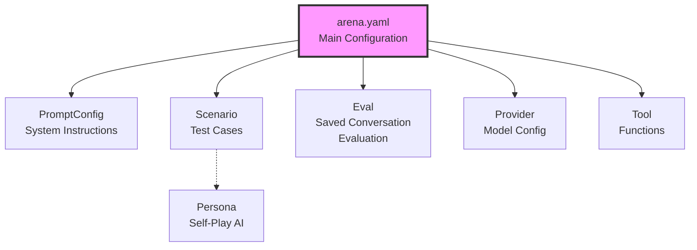

This document provides a comprehensive reference for all PromptArena configuration files, including every field, its purpose, and examples.

## Configuration File Types

PromptArena uses five main types of configuration files:



## Arena Configuration

The main configuration file that orchestrates all testing.

### Complete Structure

```yaml
apiVersion: promptkit.altairalabs.ai/v1alpha1
kind: Arena
metadata:
  name: my-arena                    # Required: Unique identifier
  namespace: default                # Optional: Namespace for organization
  labels:                           # Optional: Key-value labels
    environment: production
    team: ai-engineering
  annotations:                      # Optional: Non-identifying metadata
    description: "Production test suite"
    owner: "alice@company.com"

spec:
  # Prompt configurations
  prompt_configs:
    - id: support                   # Required: Internal reference ID
      file: prompts/support.yaml    # Required: Path to PromptConfig file
      vars:                         # Optional: Template variable overrides
        company_name: "TechCo"
        support_email: "help@techco.com"

    - id: creative
      file: prompts/creative.yaml

  # Provider configurations
  providers:
    - file: providers/openai-gpt4o.yaml      # group defaults to "default"
    - file: providers/claude-sonnet.yaml     # group defaults to "default"
    - file: providers/gemini-flash.yaml      # group defaults to "default"
    - file: providers/mock-judge.yaml        # group: judge (not used as assistant)
      group: judge

  # Test scenarios
  scenarios:
    - file: scenarios/smoke-tests.yaml
    - file: scenarios/regression-tests.yaml
    - file: scenarios/edge-cases.yaml

  # Evaluation configurations (saved conversation evaluation)
  evals:
    - file: evals/customer-support-eval.yaml
    - file: evals/regression-eval.yaml

  # Optional: Judges (map judge name -> provider; judge inherits the provider's model)
  judges:
    - name: mock-judge
      provider: mock-judge
  judge_defaults:
    prompt: judge-simple
    prompt_registry: ./prompts

  # Optional: Tool definitions
  tools:
    - file: tools/weather-api.yaml
    - file: tools/database-query.yaml
    - file: tools/calculator.yaml

  # Optional: MCP server configurations
  mcp_servers:
    filesystem:
      command: npx
      args:
        - "@modelcontextprotocol/server-filesystem"
        - "/path/to/data"
      env:
        NODE_ENV: production
        LOG_LEVEL: info

    memory:
      command: python
      args:
        - "-m"
        - "mcp_memory_server"
      env:
        MEMORY_BACKEND: redis
        REDIS_URL: redis://localhost:6379

  # Global defaults
  defaults:
    # LLM parameters
    temperature: 0.7                # Default: 0.7
    top_p: 1.0                      # Default: 1.0
    max_tokens: 1500                # Default: varies by provider
    # Execution settings
    concurrency: 3                  # Default: 1 (number of parallel tests)
    timeout: 30s                    # Default: 30s (per test)
    max_retries: 0                  # Default: 0 (retry failed tests)

    # Output configuration
    output:
      dir: out                      # Default: "out"
      formats:                      # Default: ["json"]
        - json
        - html
        - markdown
        - junit

      # Format-specific options
      json:
        file: results.json          # Default: results.json
        pretty: true                # Default: false
        include_raw: false          # Default: false

      html:
        file: report.html           # Default: report.html
        include_metadata: true      # Default: true
        theme: light                # Default: light (or "dark")

      markdown:
        file: report.md             # Default: report.md
        include_details: true       # Default: true

      junit:
        file: junit.xml             # Default: junit.xml
        include_system_out: true    # Default: false

      # Optional: Session recording for debugging and replay
      recording:
        enabled: true               # Default: false
        dir: recordings             # Default: "recordings" (subdirectory of output.dir)

    # Failure behavior
    fail_on:                        # Conditions that cause test failure
      - assertion_failure           # Assertion didn't pass
      - provider_error              # Provider API error
      - timeout                     # Test exceeded timeout
      - validation_error            # Validator/guardrail triggered

    # Optional: State management
    state:
      enabled: true                 # Default: false
      max_history_turns: 10         # Default: 10
      persistence: memory           # Default: memory (or "redis")
      redis_url: redis://localhost:6379  # Required if persistence=redis
```

### Field Descriptions

#### `prompt_configs`

Array of prompt configuration references.

**Fields**:
- `id` (string, required): Internal ID used to reference this prompt in scenarios
- `file` (string, required): Path to PromptConfig YAML file (relative to arena.yaml)
- `vars` (object, optional): Override template variables defined in the prompt's `variables` with `required: false`

**Variable Override Workflow**:

Variables flow through three levels with the following precedence (highest to lowest):
1. **Runtime variables** - Passed at execution time via SDK/CLI
2. **Arena configuration** - Defined in `prompt_configs[].vars`
3. **Prompt defaults** - Defined in PromptConfig's `variables` array (for non-required variables)

**Example**:

```yaml
# arena.yaml
prompt_configs:
  - id: support
    file: prompts/support.yaml
    vars:
      company_name: "ACME Corp"
      support_hours: "24/7"
      support_email: "help@acme.com"
```

```yaml
# prompts/support.yaml
spec:
  variables:
    - name: company_name
      type: string
      required: false
      default: "Generic Company"
      description: "Company name for branding"
    - name: support_hours
      type: string
      required: false
      default: "9 AM - 5 PM"
      description: "Customer support operating hours"
    - name: support_email
      type: string
      required: false
      default: "support@example.com"
      description: "Support contact email"
  
  system_template: |
    You are a support agent for {{company_name}}.
    Our hours: {{support_hours}}
    Contact: {{support_email}}
```

In this example, the arena.yaml vars override the defaults, so the rendered template will use "ACME Corp", "24/7", and "help@acme.com".

#### `providers`

Array of provider configuration references.

**Fields**:
- `file` (string, required): Path to Provider YAML file

**Example**:
```yaml
providers:
  - file: providers/openai-gpt4o.yaml
  - file: providers/claude-sonnet.yaml
```

#### `scenarios`

Array of test scenario references.

**Fields**:
- `file` (string, required): Path to Scenario YAML file

**Example**:
```yaml
scenarios:
  - file: scenarios/basic-qa.yaml
  - file: scenarios/tool-calling.yaml
```

#### `tools`

Optional array of tool definition references.

**Fields**:
- `file` (string, required): Path to Tool YAML file

**Example**:
```yaml
tools:
  - file: tools/weather.yaml
  - file: tools/search.yaml
```

#### `mcp_servers`

Optional list of MCP (Model Context Protocol) server configurations. Each
entry has exactly one transport selected by which fields are set.

**Common fields**:
- `name` (string, required): Registry key. Used as the server prefix in
  qualified tool names (`mcp__<name>__<tool>`) for stdio/url entries.
- `timeout_ms` (integer, optional): Per-request timeout in milliseconds.
- `tool_filter` (object, optional): `allowlist` / `blocklist` of tool
  names to include or exclude.

**Transport — `command` (stdio)**

PromptArena spawns a local subprocess and speaks MCP over stdio.

- `command` (string, required): Executable to run.
- `args` (string array, optional): Command-line arguments.
- `env` (string→string map, optional): Environment variables.
- `working_dir` (string, optional): Working directory for the subprocess.

```yaml
mcp_servers:
  - name: filesystem
    command: npx
    args: ["-y", "@modelcontextprotocol/server-filesystem", "/data"]
    env:
      NODE_ENV: production
```

**Transport — `url` (HTTP+SSE)**

PromptArena connects to an already-running server.

- `url` (string, required): Base URL. The server must serve `GET /sse` and
  `POST /message?sessionID=...` per the MCP HTTP+SSE transport.
- `headers` (string→string map, optional): Headers added to every request
  (e.g. `Authorization`).

```yaml
mcp_servers:
  - name: hosted-tools
    url: https://mcp.example.com
    headers:
      Authorization: "Bearer ${MCP_TOKEN}"
```

**Transport — `source` (host-provisioned)**

A registered `MCPSource` opens the endpoint at a scope boundary and
closes it when the boundary ends. See
[Provision an MCP Sandbox per Scenario](/arena/how-to/provision-mcp-sandbox/)
for the full guide.

- `source` (string, required): Name of a registered `MCPSource`
  (e.g. `docker`).
- `scope` (string, required): One of `run`, `scenario`, `session`.
- `source_args` (object, optional): Source-specific arguments. Schema
  varies per source. The built-in `docker` source accepts `image`,
  `repo`, `branch`, `env`, `mounts`. Templated against scenario
  variables (`{{scenario.<key>}}`) before `Open()`.

```yaml
mcp_servers:
  - name: sandbox
    source: docker
    scope: session
    source_args:
      image: ghcr.io/altairalabs/codegen-sandbox:latest
      repo: "{{scenario.repo}}"
      branch: "{{scenario.branch}}"
```

Tools discovered from a source-backed server are registered under their
**raw** MCP name (`Read`, `Edit`, …) rather than the namespaced
`mcp__<server>__<tool>` form used by stdio/url entries.

#### `defaults.output`

Output configuration for test results.

**Fields**:
- `dir` (string): Output directory path
- `formats` (array): Output formats to generate
  - `json`: JSON results file
  - `html`: Interactive HTML report
  - `markdown`: Markdown report
  - `junit`: JUnit XML (for CI/CD)
- Format-specific options (see structure above)
- `recording` (object, optional): Session recording configuration
  - `enabled` (bool): Enable session recording (default: false)
  - `dir` (string): Subdirectory for recordings (default: "recordings")

**Session Recording**: When enabled, Arena captures detailed event streams for each test run, including audio data for voice conversations. Recordings can be used for debugging, replay, and analysis. See [Session Recording Guide](/arena/how-to/session-recording/) for details.

#### `defaults.fail_on`

Array of conditions that should cause test failure.

**Values**:
- `assertion_failure`: Any assertion fails
- `provider_error`: Provider API returns error
- `timeout`: Test exceeds configured timeout
- `validation_error`: Validator/guardrail triggers

## PromptConfig

Defines a prompt's system instructions, validators, and metadata.

### Complete Structure

```yaml
apiVersion: promptkit.altairalabs.ai/v1alpha1
kind: PromptConfig
metadata:
  name: customer-support
  labels:
    task: support
    version: v2.0
    department: customer-success

spec:
  task_type: support                # Required: Categorization
  version: v2.0.0                   # Optional: Semantic version
  description: |                    # Optional: Human description
    Customer support bot for e-commerce platform.
    Handles orders, returns, and technical support.

  # Main system prompt
  system_template: |                # Required: System instructions
    You are a helpful customer support agent for ShopCo.

    Your capabilities:
    - Answer product questions
    - Track orders
    - Process returns and refunds
    - Troubleshoot technical issues
    - Escalate to humans when needed

    Tone: Professional, empathetic, solution-focused

    Guidelines:
    - Greet warmly
    - Ask clarifying questions
    - Provide clear instructions
    - Acknowledge frustration
    - Offer alternatives

  # Optional: Template variables
  variables:
    - name: company_name
      type: string
      required: true
      description: "Company name for branding"
      example: "ShopCo"
    - name: support_email
      type: string
      required: true
      description: "Support contact email"
      example: "help@shopco.com"
    - name: hours_of_operation
      type: string
      required: true
      description: "Business hours"
      example: "9 AM - 5 PM EST"
    - name: return_policy
      type: string
      required: true
      description: "Return policy details"
      example: "30-day returns on unused items"

  # Optional: Runtime validators/guardrails
  validators:
    - type: banned_words
      params:
        words:
          - guarantee
          - promise
          - definitely
        message: "Avoid absolute promises"

    - type: max_length
      params:
        max_characters: 1000
        max_tokens: 250
        message: "Keep responses concise"

    - type: max_sentences
      params:
        max_sentences: 8
        message: "Maximum 8 sentences"

```

### Field Descriptions

#### `task_type`

Categorizes the prompt's purpose.

**Common Values**:
- `general`: General-purpose assistant
- `support`: Customer support
- `creative`: Content generation
- `analysis`: Data/text analysis
- `code`: Code generation/review
- `qa`: Question answering

#### `system_template`

The system prompt sent to the LLM. Supports template variables using `{{variable_name}}` syntax.

**Example with Variables**:
```yaml
spec:
  variables:
    - name: company_name
      type: string
      required: false
      default: "TechCo"
      description: "Company name for branding"
    - name: support_email
      type: string
      required: false
      default: "help@techco.com"
      description: "Support contact email"
    - name: business_hours
      type: string
      required: false
      default: "9 AM - 5 PM EST"
      description: "Business operating hours"
  
  system_template: |
    You are a support agent for {{company_name}}.
    Contact us at {{support_email}}.
    Hours: {{business_hours}}
```

Variables are substituted when the prompt is assembled. They can be overridden in arena.yaml using the `prompt_configs[].vars` field.

#### `variables`

Array of variable definitions with rich metadata. Variables can be referenced in `system_template` using `{{variable_name}}` syntax.

**Variable Fields**:
- `name` (string, required): Variable name
- `type` (string, required): Data type - `string`, `number`, `boolean`, `array`, `object`
- `required` (boolean, required): Whether variable must be provided
- `default` (any, optional): Default value (for non-required variables)
- `description` (string, optional): Human-readable description
- `example` (any, optional): Example value
- `validation` (object, optional): Validation rules (e.g., `pattern`, `minLength`, `maxLength`, `min`, `max`)

**Example - Required Variables**:
```yaml
variables:
  - name: customer_id
    type: string
    required: true
    description: "Unique customer identifier"
    example: "CUST-12345"
  - name: account_type
    type: string
    required: true
    description: "Account tier"
    example: "premium"
    validation:
      pattern: "^(basic|premium|enterprise)$"
  - name: max_retries
    type: number
    required: true
    description: "Maximum retry attempts"
    example: 3
    validation:
      min: 1
      max: 10

system_template: |
  Customer: {{customer_id}}
  Account: {{account_type}}
  Max Retries: {{max_retries}}
```

**Example - Optional Variables with Defaults**:
```yaml
variables:
  - name: company_name
    type: string
    required: false
    default: "ACME Inc"
    description: "Company name for branding"
  - name: support_tier
    type: string
    required: false
    default: "Premium"
    description: "Support service level"
  - name: response_timeout
    type: number
    required: false
    default: 24
    description: "Maximum response time in hours"
  - name: features_enabled
    type: array
    required: false
    default: ["chat", "email", "phone"]
    description: "Enabled support channels"
```

**Variable Overrides**: Values can be overridden in arena.yaml:

```yaml
# arena.yaml
prompt_configs:
  - id: premium-support
    file: prompts/support.yaml
    vars:
      support_tier: "Enterprise"  # Overrides "Premium"
      response_timeout: 4  # Overrides 24
```

**Variable Precedence**:
Required variables must be provided either:
- In arena.yaml via `prompt_configs[].vars`
- At runtime via SDK/API calls
- Through scenario-specific configuration

Optional variables use defaults if not provided.

#### `validators`

Array of runtime validators/guardrails. See [Validators Reference](/arena/reference/validators/) for full list.

**Structure**:
```yaml
validators:
  - type: validator_name
    params:
      param1: value1
      param2: value2
    message: "Optional description"
```

## Scenario

Defines a test case with conversation turns and assertions.

### Complete Structure

```yaml
apiVersion: promptkit.altairalabs.ai/v1alpha1
kind: Scenario
metadata:
  name: order-tracking
  labels:
    category: support
    priority: high
    automated: true

spec:
  task_type: support                # Required: Must match prompt task_type
  description: |                    # Optional: Test description
    Test order tracking conversation flow.
    Verifies proper acknowledgment and assistance.

  # Conversation turns
  turns:
    # User turn
    - role: user                    # Required: "user" or "assistant"
      content: |                    # Required: Turn content
        I want to track my order #12345

      assertions:                   # Optional: Checks for this turn
        - type: content_includes
          params:
            patterns: ["track"]
            message: "Should acknowledge tracking request"

        - type: content_matches
          params:
            pattern: "(?i)(order|#12345)"
            message: "Should reference order number"

    # Another user turn
    - role: user
      content: "It says out for delivery but I haven't received it"
      assertions:
        - type: content_matches
          params:
            pattern: "(?i)(understand|help|check)"
            message: "Should offer assistance"

    # Optional: Explicit assistant turn (for context)
    - role: assistant
      content: |
        I understand your concern. Let me check the delivery
        status for you.
      # No assertions on assistant turns

    # Tool calling assertion
    - role: user
      content: "Please check the status"
      assertions:
        - type: tools_called
          params:
            tools:
              - check_order_status
            message: "Should call order status tool"

    # Self-play turn with natural termination
    - role: gemini-user              # Self-play role (must match a configured role)
      persona: detail-planner        # Persona ID
      turns: 2                       # Minimum turns (exact count if max_turns absent)
      max_turns: 8                   # Upper bound; enables natural termination when > turns

  # Optional: Context metadata (for documentation and reporting)
  context:
    goal: "Verify order tracking flow"     # Arbitrary key-value pairs
    user_type: "concerned customer"

  context_metadata:
    domain: "e-commerce"                   # Domain
    user_role: "support agent"             # LLM role
    project_stage: "production"            # Project stage
```

### Field Descriptions

#### `turns`

Array of conversation turns. Each turn is either a scripted user message, an assistant message, or a self-play turn.

**Scripted Turn Fields**:
- `role` (string, required): `"user"` or `"assistant"`
- `content` (string, required): Turn content
- `assertions` (array, optional): Checks to run (user turns only)

**Self-Play Turn Fields**:
- `role` (string, required): A self-play role (e.g. `"gemini-user"`) matching a configured role in `self_play.roles`
- `persona` (string, required): Persona ID to use for message generation
- `turns` (int, optional): Number of self-play exchanges. Exact count if `max_turns` absent. Defaults to 1.
- `max_turns` (int, optional): Upper bound on turns. When `max_turns > turns`, natural termination is enabled — the self-play LLM can end the conversation after the minimum turns.

**User Turn**: Triggers LLM generation, assertions check the response
**Assistant Turn**: Provides context, no LLM generation
**Self-Play Turn**: Generates user messages via a persona LLM, each triggering an assistant response

#### `assertions`

Array of checks to verify LLM behavior. See [Assertions Reference](/arena/reference/assertions/) for full list.

**Structure**:
```yaml
assertions:
  - type: assertion_name
    params:
      param1: value1
    message: "Human-readable description"
```

#### `context` and `context_metadata`

Optional metadata about the scenario. `context` is a free-form key-value map. `context_metadata` has typed fields: `domain`, `user_role`, `project_stage`.

## Provider

Configures an LLM provider for testing.

### Complete Structure

```yaml
apiVersion: promptkit.altairalabs.ai/v1alpha1
kind: Provider
metadata:
  name: openai-gpt4o-mini
  labels:
    provider: openai
    tier: production
    cost: low

spec:
  type: openai                      # Required: Provider type
  model: gpt-4o-mini                # Required: Model name

  # Optional: API endpoint override
  base_url: https://api.openai.com/v1

  # Optional: Custom HTTP headers injected into every request.
  # Useful for OpenAI-compatible gateways (OpenRouter, LiteLLM, etc.)
  # that require app attribution or custom auth headers. Values are
  # plain strings — use the credential field for secrets. Collisions
  # with built-in headers (Authorization, Content-Type, etc.) are
  # rejected at request time with an error.
  headers:
    HTTP-Referer: https://myapp.com
    X-Title: My App

  # Optional: Credential configuration
  credential:
    api_key: ""                     # Direct API key (not recommended)
    credential_file: ""             # Path to file containing API key
    credential_env: ""              # Environment variable name

  # Optional: Platform configuration (for cloud hosting)
  platform:
    type: ""                        # bedrock, vertex, or azure
    region: ""                      # AWS/GCP region
    project: ""                     # GCP project ID (Vertex only)
    endpoint: ""                    # Custom endpoint URL (Azure)

  # Model parameters
  defaults:
    temperature: 0.7                # Sampling temperature (0.0-2.0)
    top_p: 1.0                      # Nucleus sampling (0.0-1.0)
    max_tokens: 500                 # Max response length

  # Optional: Include raw API responses in output
  include_raw_output: false         # Default: false

  # Optional: Cost overrides (defaults from provider)
  pricing:
    input_per_1k: 0.00015           # Cost per 1K input tokens
    output_per_1k: 0.0006           # Cost per 1K output tokens
    cached_per_1k: 0.00001          # Cost per 1K cached tokens (if supported)
```

### Provider Groups and Judges

- `providers[*].group` (optional): Logical group label; defaults to `default`.
- `scenario.provider_group` (optional): Choose which provider group to use for assistant runs; defaults to `default`.
- Put judge-only providers in a separate group (e.g., `group: judge`) so they are not used as assistants, while still referencing them from `spec.judges`.
- `judges` / `judge_defaults` (optional): Map judge names to providers and set default judge prompt/registry for LLM-as-judge assertions.

### Provider Types

#### OpenAI

```yaml
spec:
  type: openai
  model: gpt-4o-mini | gpt-4o | gpt-4 | gpt-3.5-turbo
  # Authentication: OPENAI_API_KEY environment variable
```

**Supported Models**:
- `gpt-4o`: Latest GPT-4 Omni model
- `gpt-4o-mini`: Faster, cheaper GPT-4 variant
- `gpt-4`: GPT-4 (various versions)
- `gpt-3.5-turbo`: GPT-3.5

#### Anthropic

```yaml
spec:
  type: anthropic
  model: claude-3-5-sonnet-20241022 | claude-3-haiku-20240307
  # Authentication: ANTHROPIC_API_KEY environment variable
```

**Supported Models**:
- `claude-3-5-sonnet-20241022`: Claude 3.5 Sonnet
- `claude-3-opus-20240229`: Claude 3 Opus
- `claude-3-haiku-20240307`: Claude 3 Haiku

#### Google Gemini

```yaml
spec:
  type: gemini
  model: gemini-2.0-flash-exp | gemini-1.5-pro
  # Authentication: GOOGLE_API_KEY environment variable
```

**Supported Models**:
- `gemini-2.0-flash-exp`: Gemini 2.0 Flash (experimental)
- `gemini-1.5-pro`: Gemini 1.5 Pro
- `gemini-1.5-flash`: Gemini 1.5 Flash

#### Mock Provider

```yaml
spec:
  type: mock
  model: mock-model
  defaults:
    temperature: 0.7
```

Mock provider for testing without API calls. Returns predefined responses.

### Credential Configuration

Credentials can be configured in multiple ways with the following resolution order:

1. **`api_key`**: Direct API key value (not recommended for production)
2. **`credential_file`**: Read API key from a file
3. **`credential_env`**: Read from specified environment variable
4. **Default env vars**: Fall back to standard env vars (OPENAI_API_KEY, etc.)

**Example - Per-Provider Credentials:**
```yaml
# Production OpenAI with custom env var
spec:
  type: openai
  model: gpt-4o
  credential:
    credential_env: OPENAI_PROD_KEY

# Development OpenAI with different key
spec:
  type: openai
  model: gpt-4o-mini
  credential:
    credential_env: OPENAI_DEV_KEY
```

**Example - Credential from File:**
```yaml
spec:
  type: openai
  model: gpt-4o
  credential:
    credential_file: /run/secrets/openai-api-key
```

### Platform Configuration

Platforms allow running models on cloud hyperscalers with managed authentication:

#### AWS Bedrock

```yaml
spec:
  type: claude                      # LLM API format
  model: claude-3-5-sonnet-20241022
  platform:
    type: bedrock
    region: us-west-2
```

Uses AWS SDK credential chain:
- IRSA (EKS workload identity)
- EC2 instance roles
- `AWS_ACCESS_KEY_ID` / `AWS_SECRET_ACCESS_KEY` env vars

Model names are automatically mapped (e.g., `claude-3-5-sonnet-20241022` → `anthropic.claude-3-5-sonnet-20241022-v2:0`).

#### GCP Vertex AI

```yaml
spec:
  type: claude
  model: claude-3-5-sonnet-20241022
  platform:
    type: vertex
    region: us-central1
    project: my-gcp-project
```

Uses GCP Application Default Credentials:
- Workload Identity (GKE)
- Service account keys
- `GOOGLE_APPLICATION_CREDENTIALS` env var

#### Azure AI Foundry

```yaml
spec:
  type: openai
  model: gpt-4o
  platform:
    type: azure
    endpoint: https://my-resource.openai.azure.com
```

Uses Azure SDK credential chain:
- Managed Identity
- Azure CLI credentials
- `AZURE_CLIENT_ID` / `AZURE_TENANT_ID` / `AZURE_CLIENT_SECRET` env vars

### Authentication (Legacy)

For backward compatibility, providers can still authenticate using environment variables:

```bash
export OPENAI_API_KEY="sk-..."
export ANTHROPIC_API_KEY="sk-ant-..."
export GOOGLE_API_KEY="..."
```

## Tool

Defines a function/tool that the LLM can call.

:::tip[Choosing a mode]
For task-oriented guidance on which `mode` to use and when to reach for `mock_template` instead of `mock_result`, see [Tool Authoring](/arena/reference/tool-authoring/).
:::

### Complete Structure

```yaml
apiVersion: promptkit.altairalabs.ai/v1alpha1
kind: Tool
metadata:
  name: get-weather

spec:
  name: get_weather                 # Required: Function name
  description: |                    # Required: Function description
    Get current weather for a location

  # JSON Schema for input arguments
  input_schema:                     # Required
    type: object
    properties:
      location:
        type: string
        description: "City name or coordinates"
      units:
        type: string
        enum: ["celsius", "fahrenheit"]
        default: "celsius"
    required:
      - location

  # JSON Schema for output
  output_schema:                    # Optional
    type: object
    properties:
      temperature:
        type: number
      conditions:
        type: string
      humidity:
        type: number

  # Execution mode
  mode: live                        # Required: "mock" | "live" | "local" | "mcp" | "client"
  timeout_ms: 5000                  # Optional: Execution timeout

  # For mock mode: Static response
  mock_result:                      # Required if mode=mock
    temperature: 72
    conditions: "Sunny"
    humidity: 45

  # For mock mode: Template response
  mock_template: |                  # Alternative to mock_result
    {
      "location": "",
      "temperature": 72,
      "conditions": "Sunny"
    }

  # For live mode: HTTP configuration
  http:                             # Required if mode=live
    url: https://api.weather.com/v1/current
    method: POST                    # GET | POST | PUT | DELETE
    headers:
      Authorization: "Bearer ${WEATHER_API_KEY}"
      Content-Type: "application/json"
    headers_from_env:               # Load headers from environment
      - WEATHER_API_KEY
    timeout_ms: 5000
    redact:                         # Fields to redact in logs
      - api_key
```

### Tool Modes

#### Mock Mode (Static)

Returns predefined static response:

```yaml
mode: mock
mock_result:
  status: "success"
  data: "mock value"
```

#### Mock Mode (Template)

Returns a response that depends on the tool-call arguments. The template is Go [`text/template`](https://pkg.go.dev/text/template); arguments are exposed as the template data context (e.g. `.order_id`). The rendered output is parsed back as JSON.

```yaml
mode: mock
mock_template: |
  {{- if eq .order_id "ORD-2024-9999" -}}
  {"order_id":"ORD-2024-9999","in_warranty":true}
  {{- else if eq .order_id "ORD-2023-7788" -}}
  {"order_id":"ORD-2023-7788","in_warranty":false}
  {{- else -}}
  {"error":"not_found"}
  {{- end -}}
```

For longer templates, use `mock_template_file: <path>` (relative to the tool YAML). See [Tool Authoring](/arena/reference/tool-authoring/) for guidance on when to use template vs static.

#### Live Mode (HTTP)

Makes actual HTTP API calls:

```yaml
mode: live
http:
  url: https://api.example.com/endpoint
  method: POST
  headers:
    Authorization: "Bearer ${API_KEY}"
```

#### MCP Mode

Uses MCP server (auto-discovered, no additional config needed):

```yaml
mode: mcp
# Tool is provided by MCP server configured in arena.yaml
```

## Eval (Saved Conversation Evaluation)

Defines an evaluation configuration for replaying and validating saved conversations.

### Complete Structure

```yaml
apiVersion: promptkit.altairalabs.ai/v1alpha1
kind: Eval
metadata:
  name: customer-support-eval

spec:
  # Unique identifier
  id: customer-support-eval         # Required: Eval identifier
  
  # Description
  description: |                    # Optional: Human-readable description
    Evaluate saved customer support conversation for quality
    and adherence to support guidelines

  # Recording source
  recording:                        # Required: Recording to evaluate
    path: recordings/session-2024-01-15.recording.json
    type: session                   # session, arena_output, transcript, generic

  # Judge configurations
  judge_targets:                    # Optional: Judge providers for LLM assertions
    default:                        # Judge name (referenced in assertions)
      type: openai                  # Provider type
      model: gpt-4o                 # Model to use
      id: gpt-4o-judge              # Unique judge ID
    
    quality:
      type: anthropic
      model: claude-3-5-sonnet-20241022
      id: claude-quality-judge

  # Assertions to evaluate
  assertions:                       # Optional: Validation criteria
    - type: llm_judge
      params:
        judge: default
        criteria: |
          Does the conversation demonstrate empathy and
          provide clear, actionable solutions?
        expected: pass
    
    - type: llm_judge
      params:
        judge: quality
        criteria: "Is the tone professional and friendly?"
        expected: pass
    
    - type: contains
      params:
        text: "resolution"
        case_sensitive: false

  # Categorization
  tags:                             # Optional: Tags for filtering
    - customer-support
    - production
    - q1-2024

  # Replay behavior
  mode: instant                     # Optional: instant, realtime, accelerated
  speed: 1.0                        # Optional: Playback speed multiplier (for realtime/accelerated)
```

### Field Descriptions

#### `recording`

Specifies the saved conversation to evaluate.

**Fields**:
- `path` (string, required): Path to recording file (relative to eval file or absolute)
- `type` (string, required): Recording format type
  - `session`: Session recording JSON (`.recording.json`)
  - `arena_output`: Arena output JSON from previous runs
  - `transcript`: Transcript YAML (`.transcript.yaml`)
  - `generic`: Generic chat export JSON

**Example**:

```yaml
recording:
  path: ../recordings/2024-01-15-session.recording.json
  type: session
```

#### `judge_targets`

Defines LLM providers used for judge-based assertions.

**Structure**: Map of judge name → provider specification

**Fields** (per judge):
- `type` (string, required): Provider type (openai, anthropic, google, etc.)
- `model` (string, required): Model identifier
- `id` (string, required): Unique judge identifier

**Example**:

```yaml
judge_targets:
  default:
    type: openai
    model: gpt-4o-mini
    id: default-judge
  quality:
    type: anthropic
    model: claude-3-5-sonnet-20241022
    id: quality-judge
```

#### `assertions`

Validation criteria to evaluate against the replayed conversation.

**Common Assertion Types**:
- `llm_judge`: Use an LLM to evaluate conversation quality
- `contains`: Check if specific text appears in conversation
- `turn_count`: Validate number of conversation turns
- `tools_called`: Verify tool usage

**Example**:

```yaml
assertions:
  - type: llm_judge
    params:
      judge: default
      criteria: "Does the assistant provide accurate information?"
      expected: pass
  
  - type: contains
    params:
      text: "thank you"
      case_sensitive: false
```

#### `mode`

Controls replay timing behavior:

- `instant` (default): Replay as fast as possible
- `realtime`: Replay at original conversation speed
- `accelerated`: Replay faster than original, controlled by `speed`

#### `speed`

Playback speed multiplier (used with `realtime` or `accelerated` mode):

- `1.0` (default): Normal speed
- `2.0`: 2x speed
- `0.5`: Half speed

### Usage in Arena Configuration

Reference eval files in the main arena configuration:

```yaml
# arena.yaml
apiVersion: promptkit.altairalabs.ai/v1alpha1
kind: Arena
metadata:
  name: my-evaluations

spec:
  # Providers (needed for judge_targets if not using inline specs)
  providers:
    - file: providers/openai-gpt4o.provider.yaml
    - file: providers/claude-sonnet.provider.yaml

  # Eval configurations
  evals:
    - file: evals/customer-support-eval.yaml
    - file: evals/sales-conversation-eval.yaml
    - file: evals/technical-support-eval.yaml
```

### Recording Types

**Session Recording** (`.recording.json`):
```yaml
recording:
  path: recordings/session-123.recording.json
  type: session
```

Generated by Arena with `recording.enabled: true` in output config. Contains full event stream with timing, audio data, and metadata.

**Arena Output** (previous run results):
```yaml
recording:
  path: out/results-2024-01-15.json
  type: arena_output
```

Use results from previous Arena runs as input for regression testing.

**Transcript YAML**:
```yaml
recording:
  path: transcripts/conversation.transcript.yaml
  type: transcript
```

Human-readable transcript format (future support via recording adapters).

**Generic Chat Export**:
```yaml
recording:
  path: exports/chat-log.json
  type: generic
```

Import conversations from third-party systems (future support via recording adapters).

### Integration with Session Recording

Evals work seamlessly with Arena's session recording feature:

1. **Record** a conversation:
```yaml
# arena.yaml
spec:
  defaults:
    output:
      recording:
        enabled: true
        dir: recordings
```

2. **Create** an eval configuration:
```yaml
# evals/validate-session.eval.yaml
apiVersion: promptkit.altairalabs.ai/v1alpha1
kind: Eval
metadata:
  name: validate-session
spec:
  id: session-validation
  recording:
    path: ../recordings/run-abc123.recording.json
    type: session
  judge_targets:
    default:
      type: openai
      model: gpt-4o
      id: validator
  assertions:
    - type: llm_judge
      params:
        judge: default
        criteria: "Was the conversation helpful and accurate?"
```

3. **Run** the evaluation:
```bash
promptar ena run --config arena.yaml
```

### See Also

- **[Session Recording Guide](/arena/how-to/session-recording/)** - Enable and use session recording
- **[Assertions Reference](/arena/reference/assertions/)** - All available assertion types
- **[Replay Provider](/arena/reference/config-schema/#replay-provider)** - Replay provider details

---

## Persona (Self-Play)

Defines an AI character for self-play testing. Personas drive the user side of the conversation.

### Complete Structure

```yaml
apiVersion: promptkit.altairalabs.ai/v1alpha1
kind: Persona
metadata:
  name: frustrated-customer

spec:
  id: frustrated-customer            # Required: Unique identifier
  description: |                     # Required: Persona description
    A customer who is upset about a delayed order

  # Persona's system prompt — instructs the self-play LLM how to behave
  system_prompt: |                   # Required: Persona instructions
    You are a frustrated customer whose order is late.
    Ask about delivery status and express your concerns.
    Keep messages to 1-2 sentences.

  # Goals and constraints shape persona behavior
  goals:                             # Optional: What the persona is trying to achieve
    - Get an update on order status
    - Express frustration appropriately
  constraints:                       # Optional: Behavioral boundaries
    - Keep messages brief (1-2 sentences)
    - Stay on topic

  # Style tuning
  style:                             # Optional: Persona style
    verbosity: medium                # low, medium, high
    challenge_level: high            # low, medium, high

  # LLM defaults for this persona
  defaults:                          # Optional: Generation parameters
    temperature: 0.8                 # Sampling temperature (default: 0.7)
    seed: 42                         # Reproducibility seed
```

### Turn-Level Control

Turn count and natural termination are configured on the scenario turn, not the persona:

```yaml
turns:
  - role: gemini-user
    persona: frustrated-customer
    turns: 3           # Minimum exchanges
    max_turns: 8       # Upper bound (natural termination enabled)
```

## Next Steps

- **[Assertions Reference](/arena/reference/assertions/)** - All available assertions
- **[Validators Reference](/arena/reference/validators/)** - All validators/guardrails
- **[Output Formats](/arena/reference/output-formats/)** - Result output details

---

For complete examples, see the `examples/` directory in the repository.
