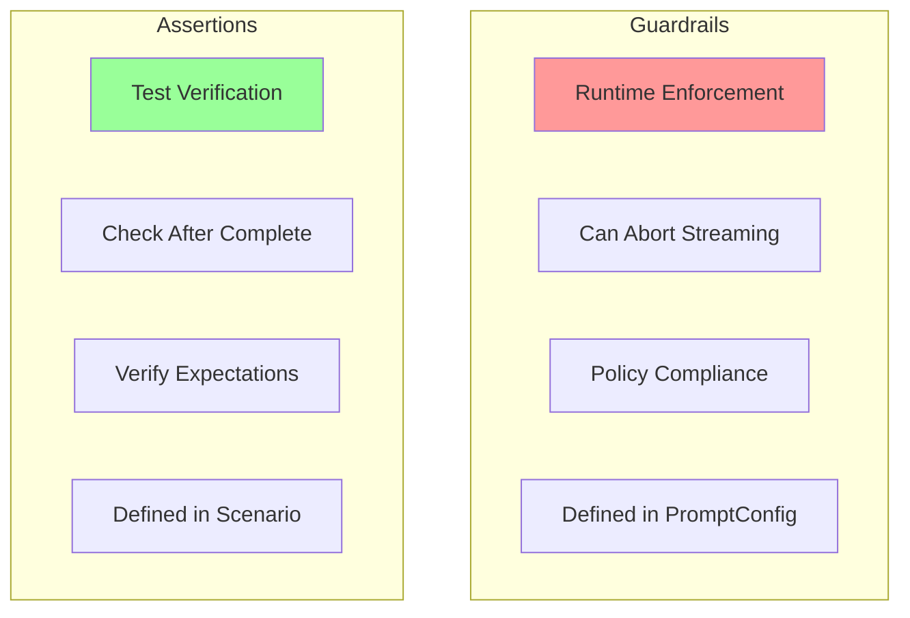
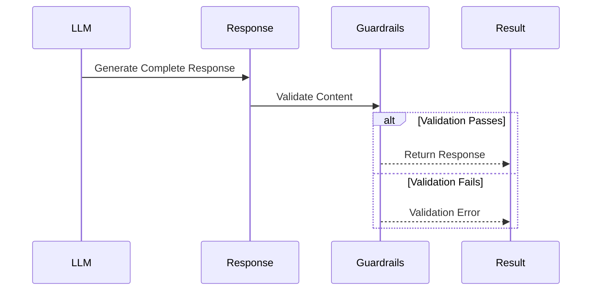
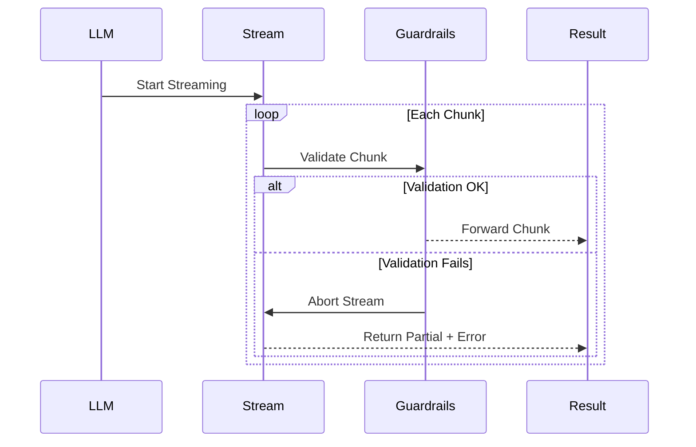
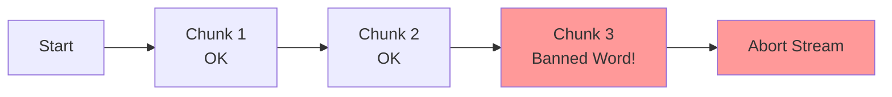

Guardrails are runtime checks that enforce policies on LLM responses. They use the same check types as assertions and evals, but run during generation and can actively modify or block content.

:::note[Check Types]
For the complete list of check types and their parameters, see the [Checks Reference](https://promptkit.altairalabs.ai/reference/checks/). This page covers guardrail-specific configuration and behavior.
:::

## Guardrails vs Assertions



**Key Differences**:

| Aspect | Guardrails | Assertions |
|--------|-----------|------------|
| Purpose | Enforce policies | Verify behavior |
| When | During generation | After generation |
| Streaming | Can abort early | Runs after complete |
| Defined In | PromptConfig | Scenario |
| Failure | Policy violation | Test failure |

## How Guardrails Work

### Non-Streaming Mode



### Streaming Mode



## Guardrail Structure

Guardrails are defined in the `validators` section of a PromptConfig:

```yaml
spec:
  validators:
    - type: check_type
      params:
        param1: value1
      message: "Policy description"
      fail_on_violation: true
```

### The `message` Field

The `message` field sets the user-facing text shown when a content-blocking guardrail fires. If omitted, a default policy message is used.

During pack compilation, `packc` folds `message` into `params["message"]` to conform to the [PromptPack schema](https://promptpack.org/schema/latest/promptpack.schema.json), which does not have a top-level `message` property on validators. You should always declare `message` at the top level in your PromptConfig YAML — the compiler handles the rest.

### Enforcement Behavior

When a guardrail triggers and `fail_on_violation` is `true` (the default):

- **Content blockers** (`banned_words` / `content_excludes`) replace content with the `message` (or a default policy message)
- **Length guards** (`max_length` / `length`) truncate content to the configured maximum
- Other check types log the violation but do not modify content

When `fail_on_violation` is `false`, the guardrail evaluates and records results in `message.Validations` but does not modify content -- equivalent to monitor-only mode.

## Guardrail-Compatible Check Types

Any check type can technically be used as a guardrail, but only certain built-in types have specific enforcement behavior. Others evaluate and record results without modifying content.

| Check Type | Aliases | Streaming | Enforcement |
|-----------|---------|-----------|-------------|
| `content_excludes` | `banned_words` | Yes | Replaces content |
| `max_length` | `length` | Yes | Truncates |
| `sentence_count` | `max_sentences` | No | Logs violation |
| `field_presence` | `required_fields` | No | Logs violation |

See the [Checks Reference](https://promptkit.altairalabs.ai/reference/checks/) for the full list of check types and their parameters.

## Streaming Guardrail Behavior

Streaming-capable guardrails abort generation immediately when a violation is detected:



Benefits of streaming guardrails:
- Catch violations immediately, preventing bad content from reaching users
- Save API costs by aborting early (no wasted tokens on a response that will be blocked)
- Faster failure detection

## Combining Guardrails

Multiple guardrails can enforce different policies simultaneously:

```yaml
validators:
  # Content safety (streaming)
  - type: banned_words
    params:
      words: ["guarantee", "promise", "definitely"]
    message: "Avoid absolute promises"

  # Length control (streaming)
  - type: max_length
    params:
      max_characters: 1000
      max_tokens: 250
    message: "Stay concise"

  # Structure (post-completion)
  - type: max_sentences
    params:
      max_sentences: 5
    message: "Maximum 5 sentences"
```

**Execution order**:
1. Streaming guardrails run during generation
2. Non-streaming guardrails run after completion
3. First failure stops the validation chain

## Examples

### Content Safety

```yaml
validators:
  - type: banned_words
    params:
      words:
        - guarantee
        - promise
        - definitely
        - "100%"
    message: "Avoid absolute promises. Use phrases like 'we'll do our best' instead."
```

### Response Length Control

```yaml
validators:
  - type: max_length
    params:
      max_characters: 2000
      max_tokens: 500
    message: "Keep responses concise"
```

### Testing Guardrails in Arena

Create scenarios that verify guardrails fire correctly:

```yaml
spec:
  turns:
    - role: user
      content: "Will this definitely work?"
      assertions:
        - type: guardrail_triggered
          params:
            guardrail: banned_words
            assertions: true
            message: "Should catch 'definitely'"
```

## Best Practices

1. **Order by speed** -- put streaming guardrails (e.g., `banned_words`, `max_length`) before post-completion checks (e.g., `max_sentences`).
2. **Use specific messages** -- give actionable guidance, not generic "invalid content" errors.
3. **Avoid overly broad rules** -- banning common words like "can" or "will" makes the system unusable.
4. **Mirror policies in the system prompt** -- tell the LLM about the same constraints so it self-corrects before guardrails need to fire.

## Custom Guardrails

For custom enforcement logic beyond the built-in check types, implement the `hooks.ProviderHook` interface and register it via the SDK:

```go
conv, _ := sdk.Open("./app.pack.json", "chat",
    sdk.WithProviderHook(&MyCustomHook{}),
)
```

See [Hooks Reference](https://promptkit.altairalabs.ai/runtime/reference/hooks/) for the `ProviderHook` API and [Checks Reference extensibility](https://promptkit.altairalabs.ai/reference/checks/#extending-the-check-system) for adding new check types.

## See Also

- [Checks Reference](https://promptkit.altairalabs.ai/reference/checks/) -- All check types and parameters
- [Unified Check Model](https://promptkit.altairalabs.ai/concepts/validation/) -- How guardrails, assertions, and evals relate
- [Assertions Reference](/arena/reference/assertions/) -- Test-time checks
- [Hooks & Guardrails](https://promptkit.altairalabs.ai/runtime/reference/hooks/) -- Runtime hook system API
- [Validation Tutorial](https://promptkit.altairalabs.ai/runtime/tutorials/04-validation-guardrails/) -- Step-by-step guardrails tutorial
